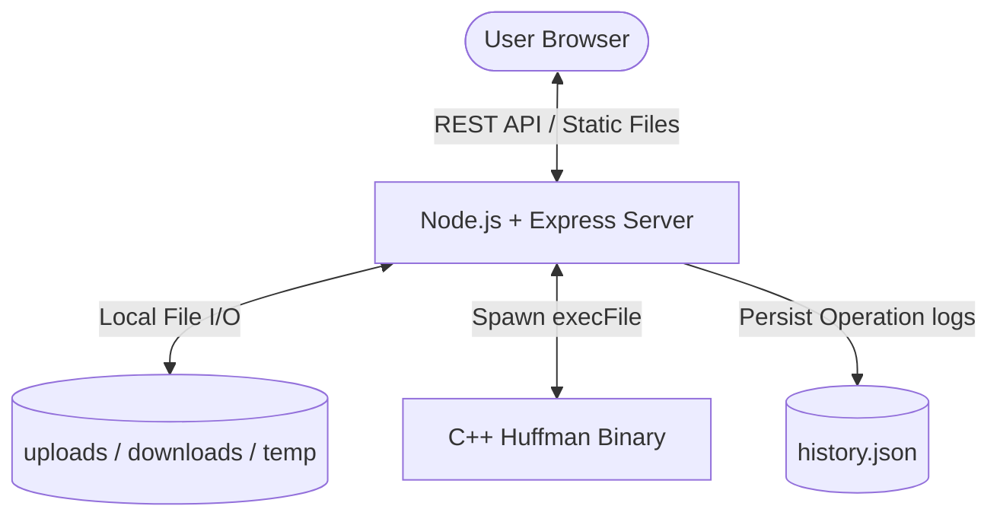
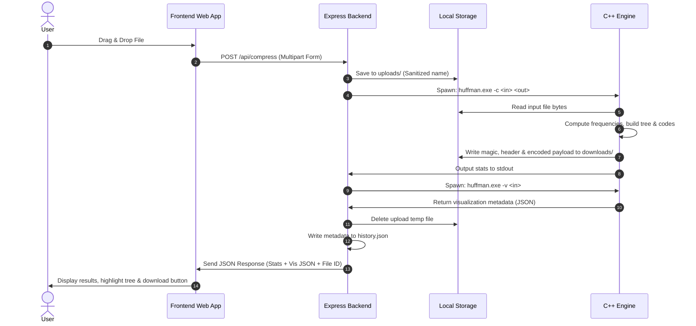

# Huffman Labs - System Architecture Documentation

This document describes the architectural layout, component relationships, data flow patterns, and security design decisions implemented in the Huffman Labs full-stack compression utility.

---

## 1. System Overview

Huffman Labs is structured as a full-stack, split-runtime application. Performance-critical algorithmic execution is kept entirely within a native C++ engine, while user interface, scheduling, server APIs, and persistence are managed by a Node.js + Express backend.

---

## 2. Process Communication & Data Flow

### A. Compression Pipeline

The sequence diagram below displays the lifecycle of a compression request:

### B. Decompression Pipeline

Decompression follows a similar, lightweight path:
1. User uploads a `.huf` file.
2. Express saves the file to `uploads/` and validates its header.
3. Express spawns `huffman.exe -d <in_huf> <out_restored>`.
4. C++ parses the binary header, reconstructs the tree, decodes the bitstream, and writes the restored file.
5. Express deletes the `.huf` upload file, logs the activity, and provides the download URL.

---

## 3. High-Quality Design Decisions

### C++ for Algorithmic Engine, Node.js for Backend
* **Performance:** Tree construction and bitwise manipulation (shifting, masking) are CPU-bound tasks. Doing this in C++ leverages optimized native instructions, minimizing memory overhead and execution time.
* **Separation of Concerns:** Keep core computer science structures (binary trees, priority queues, bit streams) written in compiled languages, making the application easily testable and embeddable in low-level microcontrollers.

### Security Configurations
* **No Shell Execution (`execFile` vs `exec`):** We execute the C++ binary using `child_process.execFile`. Unlike `exec`, `execFile` does not invoke a shell. This makes command injection attacks impossible, as file names and arguments are passed as discrete parameters rather than parsed strings.
* **Directory Traversal Prevention:** Download requests use a strict UUID validation regex `/^[a-f0-9-]{36}$/i`. Any attempt to pass relative paths (e.g. `../../etc/passwd`) is immediately rejected at the API routing layer.
* **File Upload Sanitization & Limits:** Upload sizes are capped at 15MB at the Express middleware layer. Filenames are fully sanitized of special characters to prevent directory injection.

### Automatic Housekeeping
* **Interval Sweeper:** A background cleaner runs every 10 minutes, deleting files in `uploads/`, `downloads/`, and `temp/` that are older than 15 minutes. This ensures that the server does not run out of disk space under heavy concurrent use.
